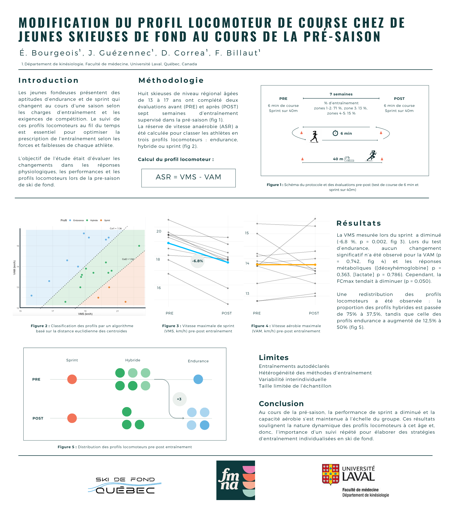

Élodie Bourgeois^1^, François Billaut^1^, Joanna Guézennec^1^, Daniel Correa^1^

1. Université Laval

:::: {.columns .column-page}
::: {.column width="47%"}

## Résumé

### Contexte

Les jeunes athlètes de ski de fond présentent différentes performances aérobies et de sprint, soit des profils locomoteurs, qui changent au cours d’une saison selon les charges d’entraînement et les exigences de compétition. La surveillance de ces profils au fil du temps est essentielle pour optimiser la prescription d’entraînement individualisée. Nous avons donc cherché à examiner les changements dans les variables physiologiques et de performance ainsi que dans la distribution des profils locomoteurs chez les jeunes skieuses de fond.

### Méthodologie

Huit skieuses régionales âgées de 13 à 17 ans ont complété des séances de tests avant (`PRE`) et après (`POST`) séparées par sept semaines dans la présaison. La répartition des zones d’intensité d’entraînement était de 71 % en zones 1-2, 13 % en zone 3 et 15 % en zones 4-5.

Les évaluations comprenaient :

- un test de course de 6 minutes pour déterminer la vitesse aérobique maximale (`VAM`);
- un sprint de 40 m pour déterminer la vitesse maximale de sprint (`VMS`);
- des mesures de la fréquence cardiaque maximale (`FCmax`);
- la concentration sanguine de lactate;
- l’échelle de perception de l’effort (`EPE`);
- l’oxygénation musculaire du vaste latéral (`SmO₂`).

Le ratio de la réserve de vitesse anaérobique (`RVA`) a été calculé comme `VMS/VAM` afin de classer les athlètes en trois profils locomoteurs : endurance, hybride ou sprint.

### Résultats

Aucun changement significatif n’a été observé pour la distance parcourue en 6 minutes (`p = 0,742`), la `VAM` (`p = 0,742`), le `SmO₂` (`p = 0,363`) ou le lactate (`p = 0,786`), tandis que la `FCmax` tendait à diminuer (`p = 0,050`).

Le temps de sprint s’est détérioré (`-5,2 %`, `p = 0,018`) et la `VMS` (`-6,8 %`, `p = 0,002`), le ratio `RVA` (`-7,6 %`, `p = 0,038`) ainsi que l’`EPE` (`-1,7 %`, `p = 0,003`) ont diminué.

Une redistribution des profils locomoteurs a été observée : les profils hybrides sont passés de 75 % à 37,5 %, tandis que les profils endurance ont augmenté de 12,5 % à 50 %. Les taux combinés de réponses défavorables et de non-réponse pour la `VAM` et la `VMS` étaient de 45 % et 100 %, respectivement.

### Conclusion

Au cours de la présaison, les athlètes ont montré une diminution quasi certaine des performances de sprint sans changement de la capacité aérobie au niveau du groupe, malgré des différences individuelles. Ces résultats soulignent la nature dynamique des profils locomoteurs et l’importance d’une surveillance répétée pour guider des stratégies d’entraînement individualisées en ski de fond.

### Financement

Fédération Ski de Fond Québec, MITACS
:::

::: {.column width="6%"}
:::

::: {.column width="47%"}

## Affiche

{fig-alt="Affiche scientifique sur les changements saisonniers dans les profils locomoteurs de course chez les jeunes femmes skieuses de fond"}
:::
::::
